```{r setup, include=FALSE}
library(knitr)
library(rmdformats)

## Global options
options(max.print="75")
opts_chunk$set(echo=FALSE,
	             cache=TRUE,
               prompt=FALSE,
               tidy=FALSE,
               comment=NA,
               message=FALSE,
               warning=FALSE)
opts_knit$set(width=75)
```

[](https://twitter.com/aaron_willcox)
[](https://twitter.com/Elliot_Gould_)

# Getting Started

These are some good starting references and further information to help
set up your environment:

-   [Install the Github CLI](https://cli.github.com/)
-   [How to use Git with R and
    RStudio](https://www.geo.uzh.ch/microsite/reproducible_research/post/rr-rstudio-git/)
-   [Setting up your github PAT and storing the
    credentials](https://usethis.r-lib.org/articles/articles/git-credentials.html)
-   [Basic git
    commands](https://www.hostinger.com/tutorials/basic-git-commands)

Code and data sharing and the way in which researchers collaborate has
shifted dynamically over the last 10 years or so. Unsurprisingly, modern
research methods and practices borrow heavily from the computer
development industry. To differentiate between the practices and to
conceptualise modern research approach to code and data sharing, we
refer to `#resops` as a way to project manage our code and software
development. Below is a diagram outlining the components and concepts of
`#resops`:

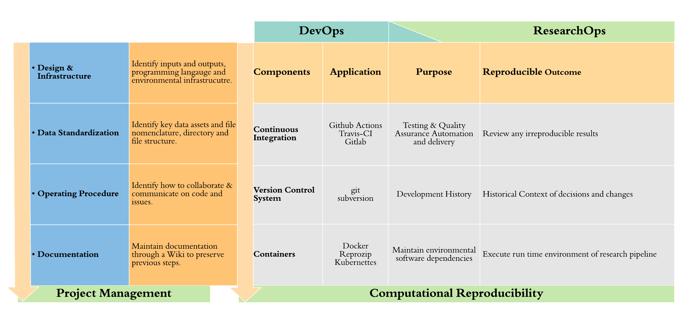

If youd like to find out more, a short presentation can be found [here
that we presented at the SORTEE2021
conference](https://github.com/psychtek/sortee2021). The following is
some of the tools and tips we use as a team to share our code and data
with the `#resops` practices in mind.

# The Workspace

Everything that you need to share, edit and collaborate with your data
and code is already available within Rstudio. For example:

-   Coding and Analysis

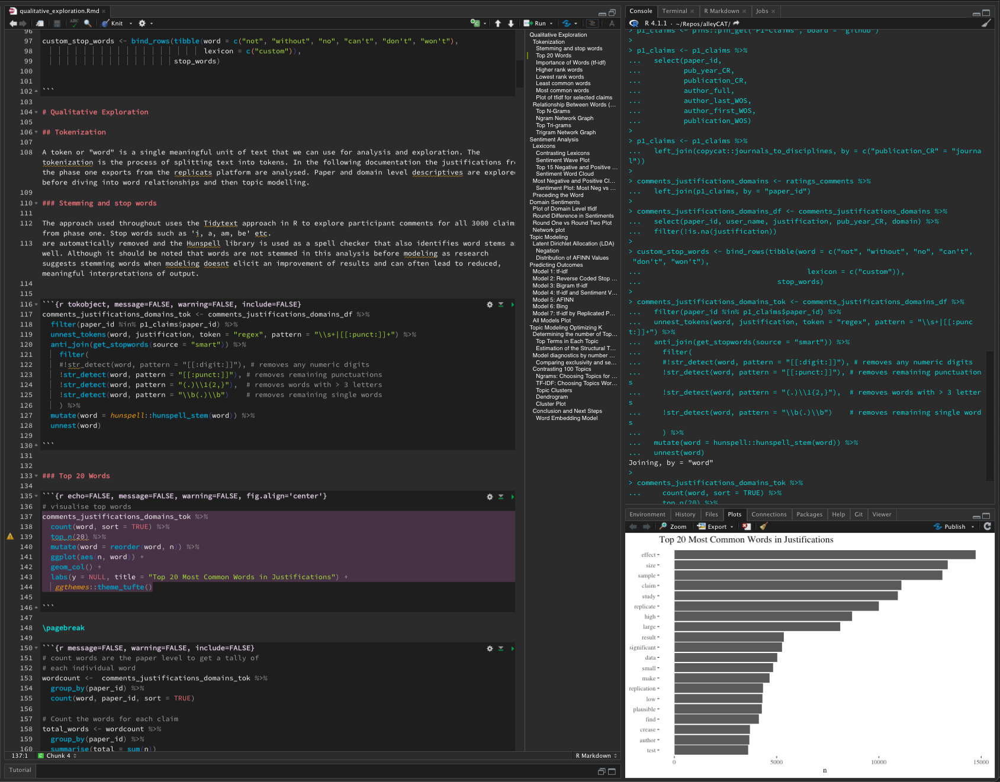

-   Using the terminal for checking issues on github
    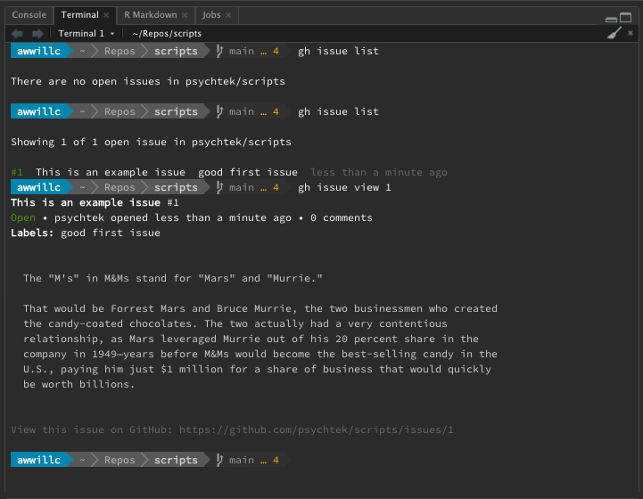
-   Manage all your github needs

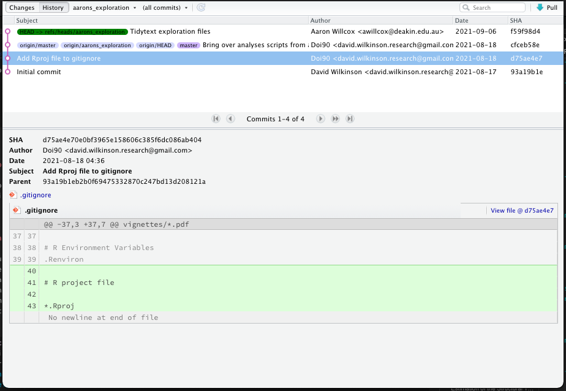

Leveraging a core set of tools and practices is essential to be able to
improve collaboration and sharing code and data. Setting up your
workspace in Rstudio efficiently and how you work is entirely personal
however, its good to ensure that, for good `#resops` , a main source of
truth is maintained and a rethinking of *how* we save and share our
data.

## Sources of Truth

A source of truth is essentially a technical asset, such as a csv file,
is stored in one permanant location, as the most updated technical
resource for collaborators to reference. The `/data` folder in the
workspace is the most common place to find such files however, when a
project grows it can be cumbersome to track the right data file across
different repositories. Nothing worse than spending ages shifting
through a git history working out which csv file everyone should be
using.

[Pins](https://github.com/rstudio/pins) is a great way to set up your
data sources with options to have local storage, github, Amazon S3 or
Azure.

::: {align="center"}
[](https://github.com/rstudio/pins)
:::

```{r eval=FALSE, message=FALSE, warning=FALSE, include=FALSE}
install.packages("pins")

```

Once it is setup you can access data tables with the inbuilt functions,
through the connections tab or through the addins menu at the top of the
menu bar.

-   Sharing and exploring datasets using the connections tab
    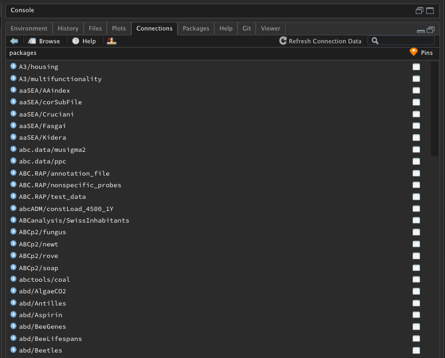

All the connections you setup are displayed in the `connections` tab
including any Mysql or PostgreSQL databases where you can browse at your
leisure.\
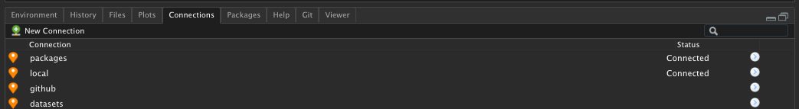

-   Addins menu

::: {align="center"}
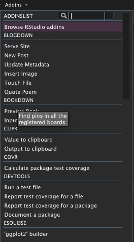
:::

::: {align="center"}
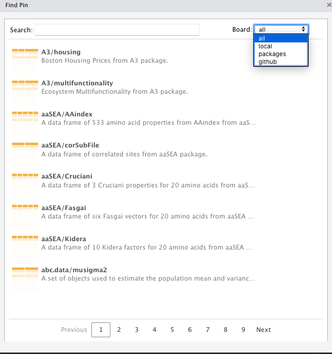
:::

For our project at repliCATs all our data sources of truth are in a
[Pins](https://github.com/rstudio/pins) repo on a private **github**
repo called `datacat`. We wrote a wrapper function that connects to this
resource and then displays all our data assets to our group. Any data
object can then be used within any R code and analysis and ensures
everyone is referencing the same file and version.

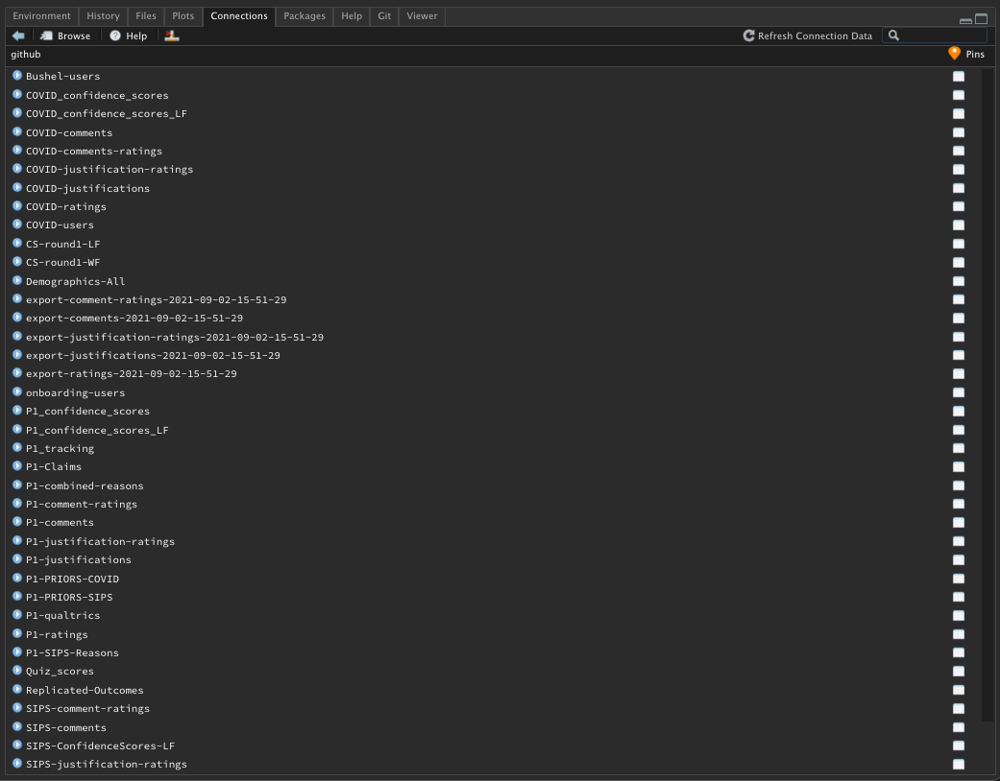

In the following example, I have my *own* datasets repository setup on
**github** and can save and access these pins from my personal board.

-   **`name`** = label you give to the board.

-   **`repo`** = url of your repo.

-   **`branch`** = branch on github you'd like to reference.

-   **`version`** = retains version information on when you update your
    pins on the board.

```{r echo=TRUE, message=FALSE, warning=FALSE}

pins::board_register_github(name = "datasets", 
                            repo = "psychtek/datasets", 
                            branch = "main", 
                            token = Sys.getenv("GITHUB_PAT"), 
                            versions = TRUE)

```

Once connected I can see in the connections tab my data tables I have
saved:

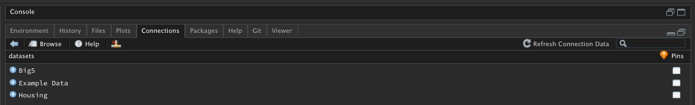{align="center"}

Once you have a custom pins board setup its then pretty straight forward
to "pin" this resource to the board (Note that team members will need
access to the repository on github). For example, ill create a basic
table and save this to my `datasets` board:

```{r, echo=TRUE}

pins::board_register_github(name = "datasets", 
                            repo = "psychtek/datasets", 
                            branch = "main", 
                            token = Sys.getenv("GITHUB_PAT"), 
                            versions = TRUE)

my_data_obj <- tibble(ID = c("AAA", "BBB", "CCC"), 
       Score = c(123, 456, 789))


pins::pin(my_data_obj, 
          name = "Scores", 
          description = "Individual Scores on some test", 
          board = "datasets")
```

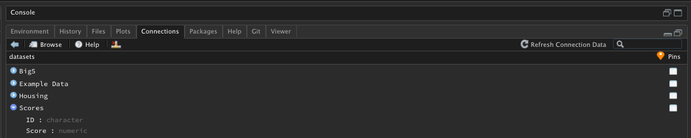{align="center"}

I can now see the Scores table is available in the connections tab. You
can then head to Github and confirm that the data table has been saved
to the cloud.

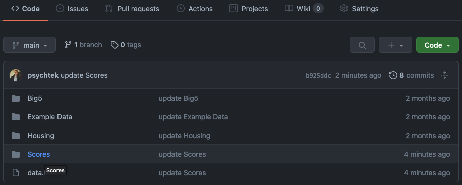{align="center"}

In this example, if we are to reference a file in the **public**
packages board we would add a line of code into any analysis like so:

```{r echo=TRUE, message=FALSE, warning=FALSE}
pins::pin_get(name = "A3/housing", board = "packages")
```

and then make any relevant analysis with the object that stores the
referenced file. In this example we grab the `A3/housing` file and store
this in an object called `housing_obj` then, run a simple `mean()`
function across some columns.

```{r echo=TRUE}
library(tidyverse)
housing_obj <- pins::pin_get(name = "A3/housing", board = "packages")

housing_obj %>% 
  select(-HIGHWAY, -TAX, -LSTAT, -MED.VALUE) %>% 
  summarise(across(.cols = everything(), .fns = ~ mean(.x)))
```

To sum up, `Pins` is a great resource to manage data resources. By
setting up your own board for your team you ensure that everyone is
sourcing the same file in any coding and analysis.

## 
